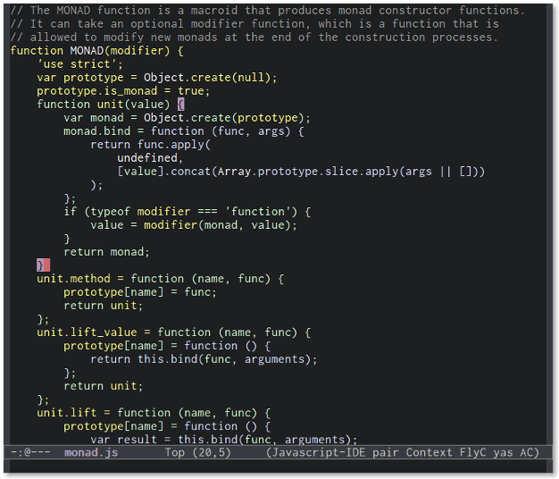
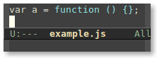

# Context Coloring [](https://travis-ci.org/jacksonrayhamilton/context-coloring) [](https://coveralls.io/r/jacksonrayhamilton/context-coloring)

<p align="center">
  
</p>

Highlights code according to function context.

- Code in the global scope is one color. Code in functions within the global
  scope is a different color, and code within such functions is another color,
  and so on.
- Identifiers retain the color of the scope in which they are declared.

Lexical scope information at-a-glance can assist a programmer in understanding
the overall structure of a program. It can help to curb nasty bugs like name
shadowing. A rainbow can indicate excessive complexity. State change within a
closure is easily monitored.

By default, context-coloring still highlights comments and strings
syntactically. It is still easy to differentiate code from non-code, and strings
cannot be confused for variables.

This coloring strategy is probably more useful than conventional syntax
highlighting. Highlighting keywords can help one to detect spelling errors, but
a [linter][] could also spot those errors, and if integrated with [flycheck][],
an extra spot opens up in your editing toolbelt.

Give context-coloring a try; you may find that it *changes the way you write
code*.

## Features

- Supported languages: JavaScript
- Light and dark (customizable) color schemes.
- Very fast for files under 1000 lines.

## Installation

Requires Emacs 24+.

JavaScript language support requires either [js2-mode][], or
[Node.js 0.10+][node] and the [scopifier][] executable.

### ELPA

- `M-x package-install RET context-coloring RET`

### Git

- Clone this repository.

```bash
cd ~/.emacs.d/
git clone https://github.com/jacksonrayhamilton/context-coloring.git
```

- Byte-compile the package for improved speed.

```bash
cd context-coloring/
make compile
```

- Add the following to your `~/.emacs` file:

```lisp
(add-to-list 'load-path "~/.emacs.d/context-coloring")
(require 'context-coloring)
```

### scopifier (for non-js2-mode users)

```bash
npm install -g scopifier
```

## Usage

Add the following to your `~/.emacs` file:

```lisp
;; non-js2-mode users:
(add-hook 'js-mode-hook 'context-coloring-mode)

;; js2-mode users:
(add-to-list 'auto-mode-alist '("\\.js\\'" . js2-mode))
(add-hook 'js2-mode-hook 'context-coloring-mode)
```

## Customizing

### Options

- `context-coloring-syntactic-comments` (default: `t`): If non-nil, also color
  comments using `font-lock`.
- `context-coloring-syntactic-strings` (default: `t`): If non-nil, also color
  strings using `font-lock`.
- `context-coloring-delay` (default: `0.25`; supported modes: `js-mode`,
  `js3-mode`): Delay between a buffer update and colorization.
- `context-coloring-js-block-scopes` (default: `nil`; supported modes:
  `js2-mode`): If non-nil, also color block scopes in the scope hierarchy in
  JavaScript.

### Color Schemes

Color schemes for custom themes are automatically applied when those themes are
active. Built-in theme support is available for: `ample`, `anti-zenburn`,
`grandshell`, `leuven`, `monokai`, `solarized`, `spacegray`, `tango` and
`zenburn`.

You can define your own theme colors too:

```lisp
(context-coloring-define-theme
 'zenburn
 :colors '("#DCDCCC"
           "#93E0E3"
           "#BFEBBF"
           "#F0DFAF"
           "#DFAF8F"
           "#CC9393"
           "#DC8CC3"
           "#94BFF3"
           "#9FC59F"
           "#D0BF8F"
           "#DCA3A3"))
```

See `C-h f context-coloring-define-theme` for more info on theme parameters.

## Extending

To add support for a new language, write a "scopifier" for it, and define a new
coloring dispatch strategy with `context-coloring-define-dispatch`. Then the
plugin should handle the rest. (See `C-h f context-coloring-define-dispatch` for
more info on dispatch strategies.)

A "scopifier" is a CLI program that reads a buffer's contents from stdin and
writes a JSON array of numbers to stdout. Every three numbers in the array
represent a range of color. For instance, if I fed the following string of
JavaScript code to a scopifier:

```js
var a = function () {};
```

Then the scopifier would produce the following array:

```js
[1,24,0,9,23,1]
```

Where, for every three numbers, the first number is a 1-indexed start [point][],
the second number is an exclusive end point, and the third number is a scope
level. The result of applying level 0 coloring to the range &#91;1, 24) and then
applying level 1 coloring to the range &#91;9, 23) would result in the following
coloring:

<p align="center">
  
</p>

If there is an abstract syntax tree generator for your language, you can walk
the syntax tree, find variables and scopes, and build their positions and levels
into an array like the one above.

For example, a Ruby scopifier might be defined and implemented like this:

```lisp
(context-coloring-define-dispatch
 'ruby
 :modes '(ruby-mode)
 :executable "ruby"
 :command "/home/username/scopifier")
```

```ruby
#!/usr/bin/env ruby
def scopifier(code)
    # Parse code.
    # Return an array.
end
print scopifier ARGF.read
```

When a `--version` argument is passed, a scopifier should print its version
number and exit. This allows context-coloring to determine if an update is
required.

[linter]: http://jshint.com/about/
[flycheck]: http://www.flycheck.org/
[js2-mode]: https://github.com/mooz/js2-mode
[node]: http://nodejs.org/download/
[scopifier]: https://github.com/jacksonrayhamilton/scopifier
[point]: http://www.gnu.org/software/emacs/manual/html_node/elisp/Point.html
