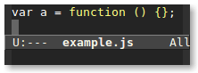

# Context Coloring [](https://travis-ci.org/jacksonrayhamilton/context-coloring)

<p align="center">
  
</p>

Highlights code according to function context.

- Code in the global scope is one color. Code in functions within the global
  scope is a different color, and code within such functions is another color,
  and so on.
- Identifiers retain the color of the scope in which they were declared.
- Comments are gray.

Lexical scope information at-a-glance can assist a programmer in understanding
the overall structure of a program. It can also help curb nasty bugs like name
shadowing or unexpected assignment. A rainbow can indicate excessive
complexity. A spot of contrast followed by an assignment expression could be a
side-effect... or, the state of a closure could be undergoing change.

This coloring strategy is probably more useful than conventional *syntax*
highlighting. Highlighting keywords can help one to detect spelling errors, and
highlighting the content between quotation marks can alert one to unclosed
string literals. But a [linter][] could also spot those errors, and if
[integrated via flycheck][integration], an extra spot opens up in your editing
toolbelt.

Give context coloring a try; you may find that it *changes the way you write
code*.

## Features

- Supported languages: JavaScript
- Light and dark (customizable) color schemes.
- Fast AST parsing. Some total parse + recolor times:
  - jQuery (9191 lines): 0.43 seconds (js2-mode), 0.63 seconds (js-mode)
  - Lodash (6786 lines): 0.19 seconds (js2-mode), 0.37 seconds (js-mode)
  - Async (1124 lines): 0.05 seconds (js2-mode), 0.17 seconds (js-mode)
  - mkdirp (98 lines): 0.005 seconds (js2-mode), 0.09 seconds (js-mode)

## Usage

Requires Emacs 24+.

JavaScript language support requires either [js2-mode][] or
[Node.js 0.10+][node], respectively.

- Clone this repository.

```bash
cd ~/.emacs.d/
git clone https://github.com/jacksonrayhamilton/context-coloring.git
```

- Add the following to your `~/.emacs` file:

```lisp
(add-to-list 'load-path "~/.emacs.d/context-coloring")
(require 'context-coloring)
(add-hook 'js-mode-hook 'context-coloring-mode)
```

## Extending

To add support for a new language, write a "scopifier" for it, and add an entry
to `context-coloring-dispatch-plist`. Then the plugin should handle the rest.

A "scopifier" is a CLI program that reads a buffer's contents from stdin and
writes a JSON array of numbers to stdout. Every three numbers in the array
represent a range of color. For instance, if I fed the following string of
JavaScript code to a scopifier,

```js
var a = function () {};
```

then the scopifier would produce the following array:

```js
[1,24,0,9,23,1]
```

Where, for every three numbers, the first number is a 1-indexed start [point][],
the second number is an exclusive end point, and the third number is a scope
level. The result of applying level 0 coloring to the range &#91;1, 24) and then
applying level 1 coloring to the range &#91;9, 23) would result in the following
coloring:

<p align="center">
  
</p>

If there is an abstract syntax tree generator for your language, you can walk
the syntax tree, find variables and scopes, and build their lengths and levels
into an array like the one above.

[linter]: https://github.com/jacksonrayhamilton/jslinted
[integration]: https://github.com/jacksonrayhamilton/jslinted#emacs-integration
[point]: http://www.gnu.org/software/emacs/manual/html_node/elisp/Point.html
[js2-mode]: https://github.com/mooz/js2-mode
[node]: http://nodejs.org/download/
[load path]: https://www.gnu.org/software/emacs/manual/html_node/emacs/Lisp-Libraries.html
